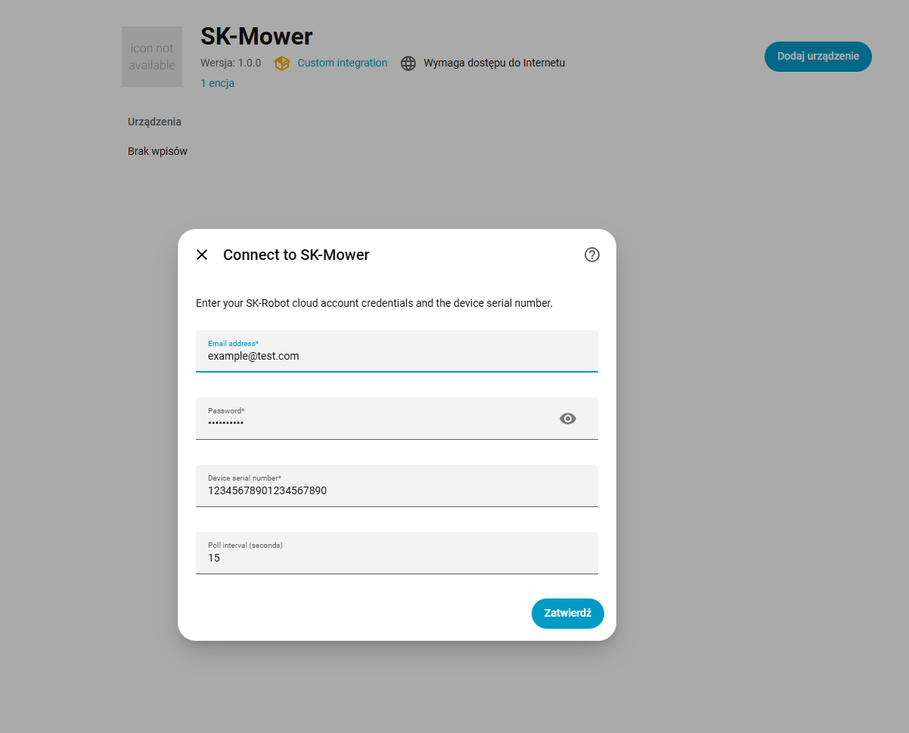

# SK-Mower Home Assistant Integration

This is a custom integration for Home Assistant to control and monitor SK-Robot (SK-Mower) robotic lawn mowers.

## Features

- **Monitoring**: Track work status (mowing, docked, going home, etc.), battery level, and various sensor data.
- **Controls**: Start mowing, stop/return to dock, and start border mowing via Home Assistant services.
- **Data Attributes**: Access detailed information such as device SN, firmware version, rain sensor status, Wi-Fi level, and more.
- **Cloud Polling**: Periodically fetches data from the SK-Mower cloud API.

## Installation

### HACS (Recommended)

1. Open HACS in your Home Assistant instance.
2. Click on "Integrations".
3. Click the three dots in the top right corner and select "Custom repositories".
4. Add `https://github.com/hansons83/skmower_component` with category "Integration".
5. Search for "SK-Mower" and click "Download".
6. Restart Home Assistant.

### Manual

1. Download the `custom_components/skmower` folder from this repository.
2. Copy it to your Home Assistant `config/custom_components/` directory.
3. Restart Home Assistant.

## Configuration

1. Go to **Settings** > **Devices & Services**.
2. Click **Add Integration**.
3. Search for **SK-Mower**.
4. Enter your device's Serial Number (SN) when prompted.

## Services

This integration provides the following services:

- `skmover.start_mowing`: Starts the mower.
- `skmover.stop_mowing`: Stops the mower and sends it back to the dock.
- `skmover.start_border`: Starts border mowing.
- `skmover.force_poll`: Forces an immediate update from the cloud.

## Buy Me a Coffee

If you find this integration useful, you can support my work by buying me a coffee:

